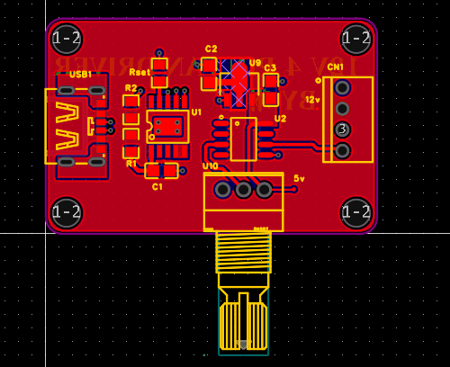
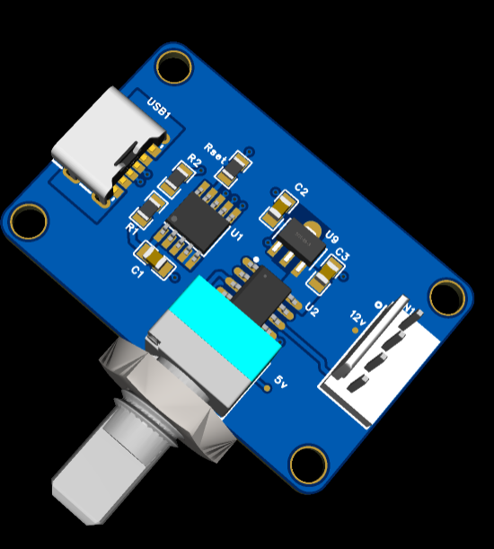

# 12v-4pin-fan-driver 12v风扇驱动器
支持PD协议的12v低成本4pin风扇驱动器，兼容市面上大多数电脑风扇  
采用6pin type-c接口，降低焊接难度。PD芯片为CH224K,大面积铺铜，可以支持大电流暴力风扇
 
12V low-profile 4-pin fan driver supporting USB-PD , compatible with most computer fans on the market.

